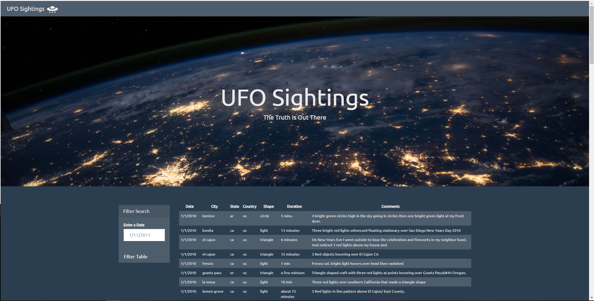
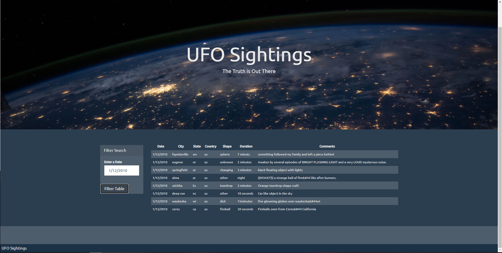

<!---Project Logo -->
 

  <h3 align="center">UFO sightings project</h3>
   

<!-- TABLE OF CONTENTS -->
## Table of Contents

* [About the Project](#about-the-project)
  * [Built With](#built-with)
* [Usage](#usage)

<!-- ABOUT THE PROJECT -->
## About The Project 
## Javascript and DOM manipulation

The extra-terrestrial menace has come to Earth and we here at `ALIENS-R-REAL` have collected all of the eye-witness reports we could to prove it! All we need to do now is put this information online for the world to see and then the matter will finally be put to rest.

There is just one tiny problem though... our collection is too large to search through manually. Even our most dedicated followers are complaining that they are having trouble locating specific reports in this mess.

That's why I wrote a code that will create a table dynamically based upon a [this dataset](StarterCode/static/js/data.js). The table also allows the users to filter the table data for specific values. I have only used pure JavaScript, HTML, and CSS, and D3.js on my web pages. 

### Built With
* [HTML](https://developer.mozilla.org/en-US/docs/Web/HTML)
* [CSS](https://developer.mozilla.org/en-US/docs/Web/CSS#:~:text=Cascading%20Style%20Sheets%20%28CSS%29%20is%20a%20stylesheet%20language,on%20paper%2C%20in%20speech%2C%20or%20on%20other%20media.)
* [Javascript](https://developer.mozilla.org/en-US/docs/Web/javascript)
  * [d3.js](https://d3js.org/)
   
## Usage
You can clone the repo locally and run the index.html file.

Here a couple of screenshots of the table.
* Homepage

* Filtered table based on date

**Additional reference materials:**

_Best-README-Template_ Retrieved from: [https://github.com/othneildrew/Best-README-Template](https://github.com/othneildrew/Best-README-Template)

